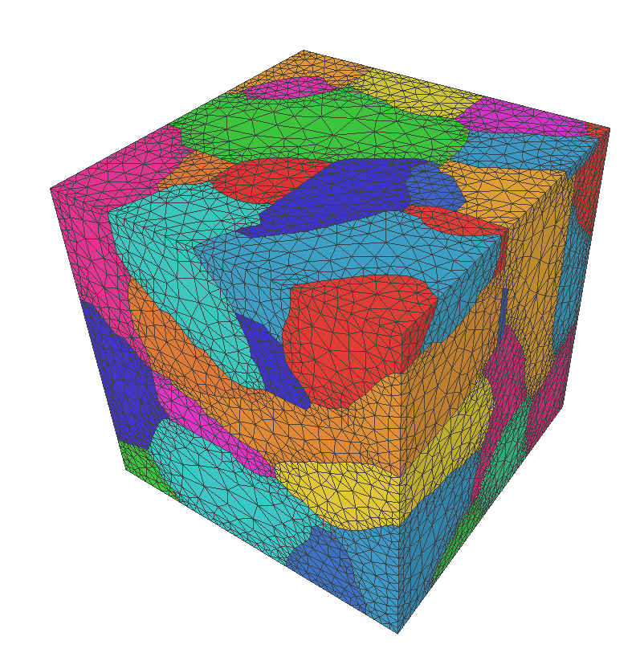
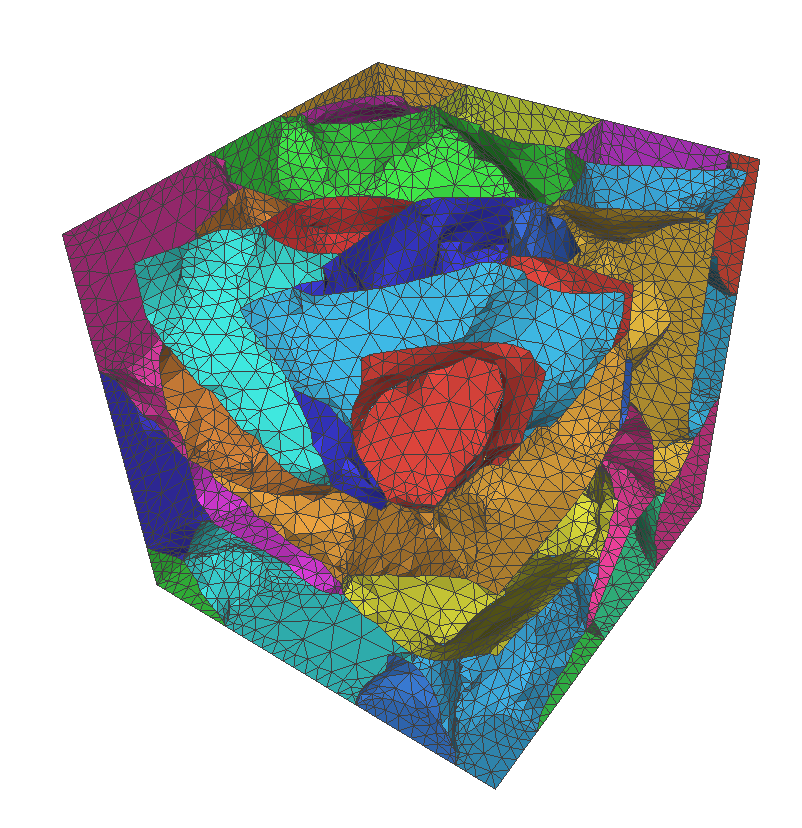

# vox2tet

Convert a labelled voxel image (3-D TIFF) into a high-quality conforming
tetrahedral mesh for finite-element computation on polycrystalline
materials, fibre-reinforced composites, or any other multi-material
3-D image.

The pipeline runs as a single binary, `run_vox2tet`:

```
voxel TIFF ─► marching cubes ─► smoothing ─► remeshing ─► tet meshing ─► .inp
                                            (TetGen or built-in CDT+MMG)
```

Based on the method from
[Sinchuk et al. (Composite Structures, 2022)][paper]. A reference
Python implementation is also available at
<https://src.koda.cnrs.fr/pprime-endo/s2m/-/tree/main/src/vox2tet>.

> **Full documentation:** [`doc/DOCUMENTATION.md`](doc/DOCUMENTATION.md)
> covers every JSON parameter, intermediate file, key algorithm, and
> mesh-quality guarantee. Measured comparisons (feature-chain
> reseeding on/off, TetGen vs the built-in CDT+MMG backend):
> [`doc/COMPARISON.md`](doc/COMPARISON.md).

## Quick start

```bash
# Build
cmake -S . -B build -DCMAKE_BUILD_TYPE=Release
cmake --build build -j

# Run on a TIFF
build/run_vox2tet  path/to/image.tif
# → outputs under path/to/vox2tet_out/image_*
```

With no arguments, `run_vox2tet` prints usage.

## Dependencies

| Library          | Source                                          |
|------------------|-------------------------------------------------|
| Eigen3           | FetchContent (automatic)                        |
| nlohmann/json    | FetchContent (automatic)                        |
| libtiff          | `apt install libtiff-dev` / `brew install libtiff` |
| TetGen (runtime) | vendored in `third-party/TetGen` (build it and put the binary on `$PATH`), or `apt install tetgen` — only for `tet_mesher: "tetgen"`; AGPL-3.0, invoked as a separate executable, never linked |
| CDT + MMG3D      | vendored in `third-party/`, built automatically — used by `tet_mesher: "cdt"` (no external binary) |
| OpenMP           | optional; comes with gcc/clang/MSVC             |

C++17 compiler + CMake ≥ 3.20.

### Building on Windows (MSYS2 / MinGW-w64)

The project builds out of the box on Windows without source modifications.
Tested toolchain: **MSYS2 UCRT64 (gcc 14+) + Ninja + CMake ≥ 3.20**.

Prerequisites (install once, e.g. via [MSYS2](https://www.msys2.org/)):

```powershell
pacman -S mingw-w64-ucrt-x86_64-gcc mingw-w64-ucrt-x86_64-ninja
```

Then, from the project root in PowerShell:

```powershell
$env:PATH = "C:\msys64\ucrt64\bin;" + $env:PATH
cmake -S . -B build -G Ninja -DCMAKE_BUILD_TYPE=Release `
      -DCMAKE_C_COMPILER=gcc -DCMAKE_CXX_COMPILER=g++ `
      -DCMAKE_CXX_FLAGS="-D_USE_MATH_DEFINES"
cmake --build build --config Release
```

Notes:

* `-D_USE_MATH_DEFINES` is required because MinGW's `<cmath>` does not
  expose `M_PI` under strict `-std=c++17`. This is the only configuration
  change needed compared to a Linux build.
* If system `libtiff` is not available, CMake's `FetchContent` falls back
  to building a vendored libtiff. Note that the vendored build is
  minimal: TIFFs using external codecs (zlib/deflate, JPEG, ZSTD, LZMA,
  WebP, …) cannot be decoded. Uncompressed, LZW, and PackBits TIFFs work
  fine. To enable compressed TIFFs, install the corresponding system
  libraries (e.g. via `pacman -S mingw-w64-ucrt-x86_64-libtiff`) and
  reconfigure — libtiff auto-detects them.
* TetGen must be on `PATH` at runtime for volume meshing
  (`pacman -S mingw-w64-ucrt-x86_64-tetgen` or a manual install).

MSVC (Visual Studio 2019+) is also supported and does not require the
`_USE_MATH_DEFINES` flag, since MSVC's `<cmath>` already exposes `M_PI`
when included.

## Input

A 3-D TIFF where each voxel value is the **material id** of that voxel.
Any integer dtype, any number of distinct labels. Background should be a
distinct id (typically 0).

## Pipeline (1-line summary of each stage)

1. **Image preparation** — small-component removal, diagonal-conn fix-up, 6-voxel boundary padding.
2. **Marching cubes** — Wu–Sullivan multi-material LUTs build a watertight non-manifold surface.
3. **Pre-remesh smoothing** — Laplacian + tangential smoothing with dihedral & corner-angle reverts.
4. **Remeshing** — `n_remesh_itr` iterations of split → collapse → flip → smooth, then active dihedral-repair and sliver-repair passes.
5. **Tet meshing** — `tet_mesher: "cdt"` (default) runs the built-in in-process pipeline (Steiner CDT for exact surface recovery + MMG3D interior quality optimization — no external binary); `tet_mesher: "tetgen"` shells out to `tetgen -pYA -q2/15 -o/150 -nn -V`.
6. **Abaqus export** — whole-volume and per-grain `.inp` files.

## Main outputs

For input `image.tif`, written to `<dir>/vox2tet_out/image_*`:

| File                | Content                                                |
|---------------------|--------------------------------------------------------|
| `image_RE.smesh`    | Watertight multi-material surface mesh (TetGen input). |
| `image_RE_ALL.stl`  | The same surface as a coloured STL (per-material hue). |
| `image_RE_G_<m>.stl`| Per-grain coloured STL (one per material id `m`).      |
| `image_RE.1.node`   | Final tet-mesh node coordinates.                       |
| `image_RE.1.ele`    | Final tet-mesh elements with per-element region id.    |
| `image_RE.1.face`   | Final tet-mesh boundary face list with interface ids.  |
| `image_RE.inp`      | Whole-volume Abaqus mesh, one element set per grain.   |
| `<m>.inp`           | Per-grain Abaqus mesh.                                 |
| `image.json`        | Snapshot of the resolved `Settings` for this run.      |

A long tail of `_xyz.npy`, `_tr.npy`, `_S_ALL.stl`, `_C3_R64.tif`, etc.
is also written for debugging / restarting from a specific stage —
see [`doc/DOCUMENTATION.md`](doc/DOCUMENTATION.md) for the full list.

## Configuration (JSON)

Run with a saved settings file:

```bash
build/run_vox2tet  config.json
```

The most useful fields:

| Field                       | Default | Effect |
|-----------------------------|---------|--------|
| `n_remesh_itr`              | 7       | Outer remesh iterations. |
| `Lmax`                      | 40.0    | Maximum edge length (voxel units). |
| `min_dangle_internal`       | 40.0    | Min dihedral (°) on interior interfaces. |
| `min_dangle_boundary`       | 20.0    | Min dihedral (°) on bounding-box edges. |
| `min_corner_angle_internal` | 30.0    | Min triangle corner angle (°). |
| `min_corner_angle_boundary` | 20.0    | Same, for bbox-only triangles. |
| `do_tetgen_meshing`         | true    | Run volume meshing (else stop at the surface). |
| `tet_mesher`                | "cdt"   | Volume-mesh backend: `"cdt"` (built-in CDT+MMG, default) or `"tetgen"` (external binary). |
| `do_save_remesh_grains_stl` | true    | Per-grain coloured STLs. |

Full list with descriptions: [`doc/DOCUMENTATION.md` §5][doc-cfg].

## Example: JMA_30

```bash
cd tests/data/JMA_30
../../../build/run_vox2tet  JMA_30.tif
```

A small polycrystal (~50 grains, 30³ voxels). Pipeline takes ~3 s on a
4-core workstation.

| Complete model | Internal grain interfaces |
|---|---|
|  |  |

Resulting mesh quality (numbers below come from the same run; the tet
section quotes TetGen's own quality report verbatim):

**Surface mesh** — 16 208 nodes / 36 653 triangles

| Metric                           | Value |
|----------------------------------|-------|
| Min triangle corner angle        | **17.95°** |
| Corner angles < 20° / < 30°      | 4 / 228 |
| Min dihedral, internal interface | **40.05°** |
| Min dihedral, boundary edge      | 42.18° |
| Violations of 40° / 20° threshold | 0 / 0 |
| Max node-to-initial-MC distance  | 0.73 voxel |

**Tetrahedral mesh** — 23 680 nodes / 125 184 tetrahedra

| TetGen metric                  | Value |
|--------------------------------|-------|
| Smallest dihedral angle        | **10.17°** |
| Largest dihedral angle         | 162.04° |
| Smallest face (triangle) angle | 13.10° |
| Largest face (triangle) angle  | 149.77° |
| Smallest aspect ratio          | 1.23  |
| Largest aspect ratio           | 11.94 |
| Smallest tet volume            | 0.0041 |
| Largest tet volume             | 4.38  |
| Tets with dihedral < 10°       | 0     |
| Tets with dihedral 10°–20°     | 2 839 of 125 k |
| Tets with dihedral 160°–180°   | 6 of 125 k |

## Programmatic use

Link against `libvox2tet.a` and call `vox2tet::generate(settings)`. The
CLI is just 15 lines of glue — see `src/app/run_vox2tet.cpp`.

## Reference

[paper]: https://doi.org/10.1016/j.compstruct.2022.116003

* Sinchuk Y., et al. *X-ray CT based multi-layer unit cell modeling of
  carbon fiber-reinforced textile composites: segmentation, meshing
  and elastic property homogenization.* **Composite Structures** 298
  (2022). <https://doi.org/10.1016/j.compstruct.2022.116003>

[doc-cfg]: doc/DOCUMENTATION.md#5-json-configuration-parameters

## License

vox2tet is distributed under the **GNU Lesser General Public License,
version 3 or later** — see [LICENSE](LICENSE) (LGPL-3.0) and
[LICENSE.GPL](LICENSE.GPL) (the GPL-3.0 text it incorporates).

Vendored third-party components keep their own licenses:
[CDT](third-party/CDT) (built in its LGPL configuration by default;
the `VOX2TET_CDT_MAROT=ON` build option enables its GPL-only face
recovery and makes the combined binary GPL),
[mmg](third-party/mmg) (LGPL-3.0), and
[TetGen](third-party/TetGen) (AGPL-3.0 — built as a *separate
executable* invoked at runtime, not linked into vox2tet).
