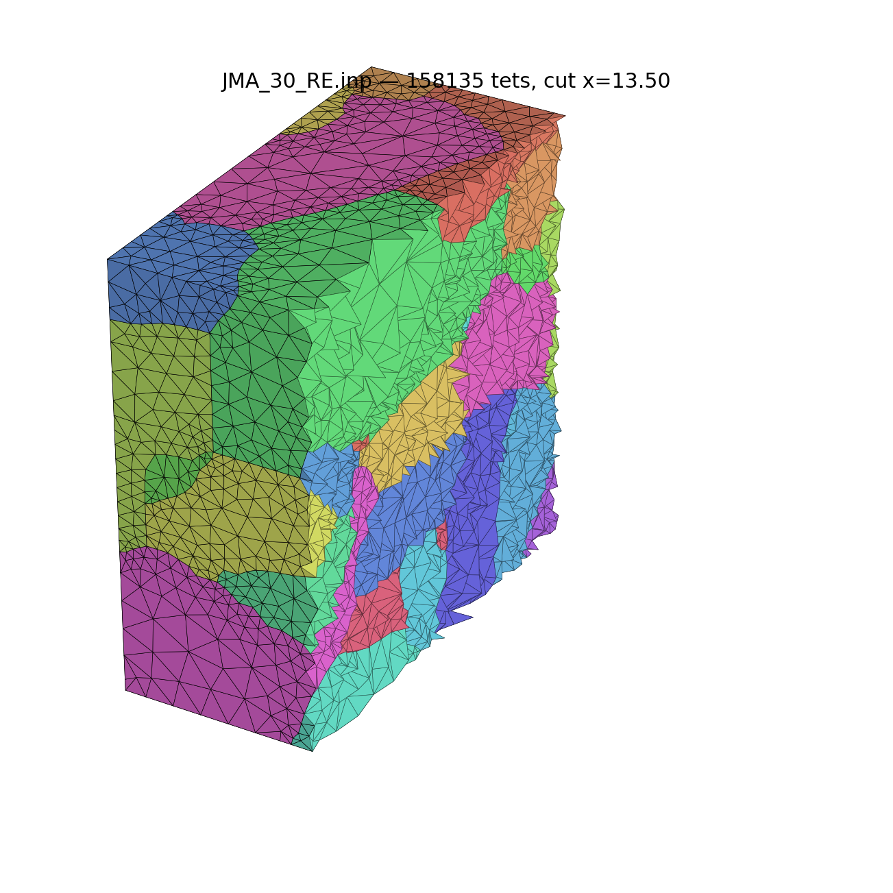

# Comparison report: chain reseeding & volume-mesh backends

Measured on the two real-data fixtures (`tests/data/JMA_10`, 10³
voxels / 3 grains, and `tests/data/JMA_30`, 30³ voxels / 54 grains),
all runs with default settings unless stated. Surface metrics come
from the pipeline's own quality passes; tet metrics are computed from
the final `.inp` (min/max dihedral per tet, aspect = longest edge over
`2√6·r_in`, 1 = equilateral). Reproduce with
`build-linux/run_vox2tet <cfg.json>` and `tools/view_inp.py` /
the quality snippet in `tools/` (see §3).

## 1. Surface: effect of feature-chain reseeding

Three configurations of the same pipeline
(see [RESEEDING.md](RESEEDING.md) for the algorithm):

* **off** — `do_reseed_bedges: false`, the legacy pipeline: every
  feature chain stays frozen at voxel spacing;
* **bbox frame only** — `do_reseed_triple_lines: false`: only the 12
  straight bounding-box edges are coarsened (Stage A);
* **full (default)** — frame + bbox-face traces + internal triple
  lines, with the composite-lfs spacing cap (Stages A + A2 + B and the
  near-chain collapse fix).

| Fixture | Reseeding | Nodes | Triangles | Min corner angle | Slivers after repair |
|---|---|---|---|---|---|
| JMA_10 | off             | 908   | 1934  | 21.6° | 19 |
| JMA_10 | bbox frame only | 718 (−21%) | 1554 (−20%) | 22.1° | 19 |
| JMA_10 | **full (default)** | **669 (−26%)** | **1439 (−26%)** | **22.1°** | 26 |
| JMA_30 | off             | 16208 | 36653 | 18.0° | 224 |
| JMA_30 | bbox frame only | 14650 (−9.6%) | 33537 (−8.5%) | 18.6° | 219 |
| JMA_30 | **full (default)** | **14068 (−13%)** | **32005 (−13%)** | **18.6°** | 247 |

Reseeding removes 13–26% of the surface elements while *improving* the
worst corner angle on both fixtures — the coarsened chains eliminate
the voxel-fine halo that used to pin sliver triangles next to feature
lines. On JMA_30 most of the gain (−9.6% of −13%) already comes from
the bbox frame alone; the triple-line stage adds the rest at the cost
of a few more post-repair slivers (247 vs 219; all remaining
sub-threshold triangles are junction/wedge-limited, the class no
remesher can improve).

## 2. Volume: TetGen vs the built-in CDT+MMG backend

Both backends consume the *same* final surface (full reseeding
defaults). TetGen 1.6 (vendored, `third-party/TetGen`) is invoked as
`tetgen -pYA -q2/15 -o/150 -nn -V`; the CDT+MMG backend
(`tet_mesher: "cdt"`) runs in-process — Steiner CDT recovers the
surface exactly, MMG3D optimizes the interior with the surface frozen.

| Fixture | Backend | Nodes | Tets | Worst min-dihedral | p1 | p10 | Worst max-dihedral | Aspect p99 / worst | Tet-step time |
|---|---|---|---|---|---|---|---|---|---|
| JMA_10 | TetGen  | 753  | 2839  | 8.1°  | 17.0° | 33.8° | 172.2° | 4.0 / 7.8 | 0.02 s |
| JMA_10 | **CDT+MMG** | 1110 | 4853  | **17.1°** | **26.2°** | 37.7° | **167.1°** | **2.6 / 4.6** | 0.7 s |
| JMA_30 | TetGen  | 18221 | 95146 | 6.2°  | 15.6° | 33.6° | 174.3° | 4.3 / 9.0 | 0.9 s |
| JMA_30 | **CDT+MMG** | 29416 | 158135 | **11.5°** | **26.7°** | 38.2° | **170.5°** | **2.6 / 5.2** | 20.8 s |

Both backends fill the RVE volume exactly (1000 / 27000, zero inverted
tets) and preserve the surface. The trade-off is clear:

* **Quality**: CDT+MMG dominates every distribution metric — the worst
  dihedral roughly doubles (6.2° → 11.5° on JMA_30), the 1st
  percentile goes from ~16° to ~27°, and the 99th-percentile aspect
  ratio drops from ~4.3 to 2.6. For FEM conditioning this is the
  difference that matters: TetGen's tail of ~4000 tets below 20°
  min-dihedral shrinks to a handful.
* **Size / speed**: TetGen produces ~40% fewer elements and is an
  order of magnitude faster (its `-q2/15` criterion is lenient; MMG's
  `optim` pass inserts more interior points to reach its quality
  targets). For JMA-scale models both are interactive; for very large
  volumes TetGen's speed may win.
* **Exactness**: CDT recovers the input surface *exactly* by
  construction (Steiner points only ever lie on the surface); TetGen's
  `-Y` flag also preserves it. The CDT path additionally cross-checks
  itself at runtime (recovered-interface-area ratio, logged).

Cut-away of the JMA_30 CDT+MMG mesh (54 grains, section at x = 13.5,
rendered with `tools/view_inp.py --save`):



## 3. Reproducing

```bash
# surface rows: toggle do_reseed_bedges / do_reseed_triple_lines in the cfg
build-linux/run_vox2tet tests/data/JMA_30/JMA_30.json

# volume rows: "cdt" is the default backend; for the tetgen rows set
# "tet_mesher": "tetgen" and put a tetgen binary on $PATH (build
# third-party/TetGen)

# interactive section view of any resulting .inp
python tools/view_inp.py <out>/JMA_30_RE.inp
```

Numbers in this report: 2026-07-19, Linux x86-64, gcc Release build,
4 threads.
